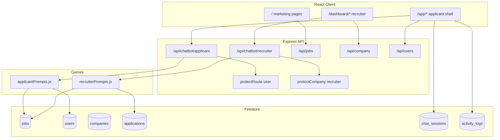

# 01 — Architecture & role separation

This document defines how **applicant** and **recruiter** experiences are isolated at every layer: routing, authentication, API, AI prompts, and data access.

---

## Design principle

> **Two products, one Firebase project.**  
> Never share chat UI, chat routes, or system prompts between roles.

Violations to avoid:

- One `/chatbot` page for both roles
- One `handleChatSession` with a `if (recruiter)` branch for data queries
- Recruiter token calling applicant-only endpoints without role checks

---

## System architecture



---

## Authentication boundaries

### Applicant (`role: user`)

| Item | Detail |
|------|--------|
| Sign-in | Firebase Google popup or email/password (candidate tab in `RecruiterLogin.jsx`) |
| Client state | `user` from `onAuthStateChanged` in [`AppContext.jsx`](../client/src/context/AppContext.jsx) |
| API header | `Authorization: Bearer <Firebase ID token>` |
| Middleware | [`protectRoute("user")`](../server/middleware/authMiddleware.js) |
| Profile store | Firestore `users/{uid}` |

### Recruiter (`role: recruiter`)

| Item | Detail |
|------|--------|
| Sign-in | Email/password → Firebase ID token stored as `companyToken` |
| Client state | `companyToken`, `companyData` in `AppContext` |
| API header | `Authorization: Bearer <Firebase ID token>` (unify; deprecate raw `token:` header) |
| Middleware | [`protectCompany`](../server/middleware/authMiddleware.js) — requires `role === "recruiter"` |
| Profile store | Firestore `companies/{uid}` |

### Custom claims

Set on registration:

- Applicant: default or explicit `role: "user"` in `users` doc
- Recruiter: `role: "recruiter"` via Admin SDK in `company/register`

`protectRoute` and `protectCompany` read `decodedToken.role` with Firestore fallback.

---

## Route map

### Frontend routes

| Route | Guard | Component (target) | Role |
|-------|-------|-------------------|------|
| `/` | Public | `Home` | Any |
| `/chatbot` | Public → redirect | Legacy; redirect to `/app/chat` when logged in | Applicant |
| `/app/chat` | `ProtectedRoute` user | `ApplicantChat` | Applicant |
| `/app/jobs` | user | `ApplicantJobs` (in shell) | Applicant |
| `/app/activity` | user | `ActivityPanel` | Applicant |
| `/applications` | user | `Applications` (optional deep link) | Applicant |
| `/resume-analyzer` | user | `ResumeAnalyzer` | Applicant |
| `/dashboard` | recruiter token | `Dashboard` | Recruiter |
| `/dashboard/manage-job` | recruiter | `ManageJobs` | Recruiter |
| `/dashboard/view-applications` | recruiter | `ViewApplications` | Recruiter |
| `/dashboard/ai` | recruiter | `RecruiterChat` | Recruiter |
| `/dashboard/analytics` | recruiter | `RecruiterAnalytics` | Recruiter |
| `/recruiter-login` | Public | `RecruiterLogin` | Any |

### Cross-role redirects

Implement in `ProtectedRoute.jsx`:

```
if (role === "recruiter" && path.startsWith("/app")) → navigate("/dashboard")
if (role === "user" && path.startsWith("/dashboard")) → navigate("/app/chat")
if (!authenticated && protected path) → show login modal
```

### Backend routes (target)

| Method | Path | Middleware | Purpose |
|--------|------|------------|---------|
| POST | `/api/chatbot/applicant/chat` | `protectRoute("user")` | Applicant chat |
| POST | `/api/chatbot/applicant/parse-resume` | `protectRoute("user")` | PDF → text |
| GET | `/api/chatbot/applicant/sessions` | `protectRoute("user")` | List chat sessions |
| POST | `/api/chatbot/applicant/sessions` | `protectRoute("user")` | Create/update session |
| POST | `/api/chatbot/recruiter/chat` | `protectCompany` | Recruiter chat |
| GET | `/api/chatbot/recruiter/sessions` | `protectCompany` | Recruiter sessions |
| GET | `/api/activity` | `protectRoute("user")` | Applicant activity feed |

**Migration:** Keep `POST /api/chatbot/chat` as alias to applicant chat until clients migrate.

Current mount in [`server.js`](../server/server.js):

```javascript
app.use('/api/chatbot', protectRoute("user"), chatbotRoutes)
```

Target:

```javascript
app.use('/api/chatbot/applicant', protectRoute("user"), applicantChatbotRoutes)
app.use('/api/chatbot/recruiter', protectCompany, recruiterChatbotRoutes)
```

---

## Data scoping rules

### Applicant queries

| Resource | Filter |
|----------|--------|
| `jobs` | `visible == true` (all public listings) |
| `users` | `doc.id == req.user.uid` only |
| `applications` | `userId == req.user.uid` |
| `resume_analyses` | `userId == req.user.uid` |
| `chat_sessions` | `userId == req.user.uid` AND `role == "user"` |

**Never** return another user's applications or resume analyses.

### Recruiter queries

| Resource | Filter |
|----------|--------|
| `jobs` | `companyId == req.company._id` |
| `applications` | Jobs where `companyId == req.company._id` (join or denormalized `companyId` on application) |
| `companies` | `doc.id == req.company._id` only |
| `chat_sessions` | `userId == req.company._id` AND `role == "recruiter"` |

**Never** return another company's jobs, applicants, or metrics.

### IDOR prevention

- Recruiter `change-status` on applications: verify `application.companyId === req.company._id`
- Job detail in chat cards: applicants may read any visible job; recruiters only own jobs in analytics intents
- Chat session by ID: verify ownership before load/delete

---

## AI layer separation

### Shared utilities (allowed)

| Module | Responsibility |
|--------|----------------|
| `server/services/chat/intentDetector.js` | Keyword/LLM intent classification (role-specific keyword sets) |
| `server/services/chat/geminiClient.js` | Model init, history formatting |
| `server/utils/parsePdf.js` | PDF buffer parsing |

### Role-specific (required)

| Module | Applicant | Recruiter |
|--------|-----------|-----------|
| System prompts | `applicantPrompts.js` — CareerBot | `recruiterPrompts.js` — HireBot |
| Controllers | `applicantChatbotController.js` | `recruiterChatbotController.js` |
| Intents | ATS_SCAN, JOB_MATCH, CAREER_ADVICE, GENERAL | PIPELINE_SUMMARY, APPLICANT_SCREEN, JOB_PERFORMANCE, JD_GENERATOR, GENERAL_HR |
| Rich tokens | `[SCORE_BADGE:n]`, `[JOB_CARD:id]` | `[METRIC_CARD:type:value]`, `[APPLICANT_CARD:id]`, `[JOB_PERF:id]` |

Existing applicant logic lives in [`chatbotController.js`](../server/controller/chatbotController.js) — extract, do not duplicate in recruiter controller.

---

## Context scopes (applicant)

These are **not** separate microservices; they are prompt + data-fetch modes inside the applicant chat handler.

### JobSearchContext

**Triggers:** Job-related intents (`JOB_MATCH`, natural language search).

**Data loaded:**

- Firestore `jobs` where `visible == true`
- Optional: client-side filter hints from Gemini structured output (location, title, remote)

**Output:** `[JOB_CARD:jobId]` tokens for top matches.

### ResumeContext

**Triggers:** PDF attached, resume text in body, ATS intents.

**Data loaded:**

- Parsed PDF text (from `parse-resume` endpoint)
- Optional: `users.resumeUrl` fetched server-side on session start

**Output:** `[SCORE_BADGE:score]` and narrative feedback.

Both contexts may be active in one turn (e.g. "score my resume and find matching jobs").

---

## Recruiter analytics context

**Triggers:** Pipeline, applicant screening, job performance intents.

**Data loaded:**

- Aggregates from `applications` scoped by `companyId`
- Job list from `jobs` where `companyId == req.company._id`
- Optional cache: `recruiter_insights_cache`

**Output:** Metric and applicant rich tokens (see [03-recruiter-dashboard-chatbot-ux.md](./03-recruiter-dashboard-chatbot-ux.md)).

---

## Session & token storage

| Role | Storage | Notes |
|------|---------|-------|
| Applicant | Firebase Auth session (browser) | ID token refreshed automatically |
| Recruiter | `localStorage.companyToken` | Must be Firebase **ID token**, not custom token |
| Chat history | Firestore `chat_sessions` | Server is source of truth |

---

## Security checklist

- [ ] All `/api/chatbot/recruiter/*` behind `protectCompany` with recruiter role check
- [ ] All `/api/chatbot/applicant/*` behind `protectRoute("user")`
- [ ] No company data in applicant Gemini prompts unless user's own application
- [ ] Firestore security rules (when added) mirror server scoping
- [ ] Service account JSON not committed; rotate if exposed
- [ ] Rate limit chat endpoints per uid (recommended)

---

## File structure (target)

```
server/
  controller/
    applicantChatbotController.js
    recruiterChatbotController.js
    chatbotController.js          # deprecated → re-export applicant
  routes/
    applicantChatbotRoutes.js
    recruiterChatbotRoutes.js
  services/chat/
    intentDetector.js
    applicantPrompts.js
    recruiterPrompts.js
    activityLogger.js

client/src/
  components/
    ProtectedRoute.jsx
    chat/
      BottomTabBar.jsx
      SettingsSheet.jsx
  layouts/
    AppShell.jsx
  pages/
    applicant/
      ApplicantChat.jsx
      ApplicantJobs.jsx
      ActivityPanel.jsx
    recruiter/
      RecruiterChat.jsx
      RecruiterAnalytics.jsx
```

---

## Related documents

- [02 — Applicant UX](./02-applicant-chatbot-ux.md)
- [03 — Recruiter UX](./03-recruiter-dashboard-chatbot-ux.md)
- [05 — API & data model](./05-api-data-model.md)
