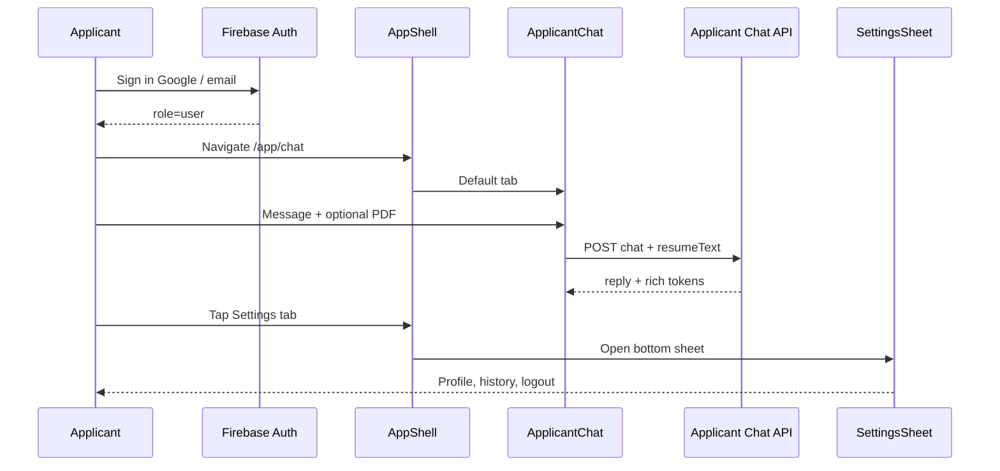

# 02 — Applicant chatbot UX (mobile-first)

Specification for the **applicant app shell**: a mobile-first chat experience with job search, resume-aware AI, activity monitoring, and a settings hub accessed from the bottom tab bar.

**Design choice:** New visual language distinct from the marketing site. The existing [`Chatbot.jsx`](../client/src/pages/Chatbot.jsx) at `/chatbot` remains a legacy/desktop fallback until redirect to `/app/chat` is implemented.

---

## User journey



### Post-login routing

| State | Destination |
|-------|-------------|
| First visit after login | `/app/chat` |
| Return visit (session valid) | Last tab or `/app/chat` |
| Not logged in on `/app/*` | Prompt sign-in (Google); block send |
| Recruiter logged in | Redirect to `/dashboard` (see architecture doc) |

---

## Information architecture

```
/app
├── /app/chat      → Chat tab (default)
├── /app/jobs      → Jobs tab
├── /app/activity  → Activity tab
└── (settings)     → Modal sheet, not a route (or /app/settings optional)
```

Legacy routes remain linkable from settings:

- `/applications` — full applications dashboard
- `/resume-analyzer` — detailed ATS report
- `/apply-job/:id` — apply flow from job cards

---

## Screen layout

### Primary frame (all tabs)

```
┌─────────────────────────────────────┐
│  ◀ (optional)   Joblet AI    [👤]  │  Top bar — 56px + safe-area-top
├─────────────────────────────────────┤
│                                     │
│         TAB CONTENT AREA            │  flex-1, overflow hidden
│         (Chat / Jobs / Activity)    │
│                                     │
├─────────────────────────────────────┤
│  [📎]  Ask anything...        [➤]   │  Sticky input — Chat tab only
├─────────────────────────────────────┤
│  💬 Chat │ 🔍 Jobs │ 📋 Activity │ ⚙ │  Bottom tab bar — 64px + safe-area-bottom
└─────────────────────────────────────┘
```

### Chat tab — thread

```
┌─────────────────────────────────────┐
│  Suggested chips (horizontal scroll) │
│  [Find jobs] [ATS score] [Tips]      │
├─────────────────────────────────────┤
│  🤖  Welcome bubble                  │
│      Hi! I'm CareerBot...            │
│                                      │
│  👤  Find remote React jobs          │
│                                      │
│  🤖  Here are matches:               │
│      ┌─────────────────────────┐   │
│      │ Senior React Dev          │   │  [JOB_CARD] renderer
│      │ Acme Corp · Remote        │   │
│      │ [Quick Apply]             │   │
│      └─────────────────────────┘   │
├─────────────────────────────────────┤
│  📄 resume.pdf              [×]      │  Attachment chip (when PDF attached)
│  [📎]  Type a message...      [➤]   │
└─────────────────────────────────────┘
```

### Settings sheet (bottom sheet)

Triggered by **⚙** tab (not a full page swap — overlay on current tab).

```
┌─────────────────────────────────────┐
│            ───  (drag handle)       │
│  Settings                           │
├─────────────────────────────────────┤
│  [Avatar]  Jane Doe                 │
│            jane@email.com           │
│  [Edit profile]                     │
├─────────────────────────────────────┤
│  📄 My resume        Uploaded ✓     │
│  📋 Applications     3 active       │
│  💬 Chat history     5 sessions     │
│  🔔 Notifications    On              │
├─────────────────────────────────────┤
│  🖥 Open full dashboard (/applications) │
│  🚪 Sign out                        │
└─────────────────────────────────────┘
```

Sheet behavior:

- Opens to 70% viewport height; swipe down or tap scrim to dismiss
- `overscroll-behavior: contain` on sheet body
- Focus trap while open (accessibility)

---

## Bottom tab bar

| Tab | Icon | Route / action | Content |
|-----|------|----------------|---------|
| **Chat** | MessageCircle | `/app/chat` | AI thread, input, PDF attach |
| **Jobs** | Search | `/app/jobs` | Searchable job list (portal jobs) |
| **Activity** | Activity | `/app/activity` | Timeline from `activity_logs` + summary cards |
| **Settings** | Settings | Opens `SettingsSheet` | Profile, resume, history, logout |

**Active state:** accent underline + icon fill `#818CF8`.

**Hide input bar** on Jobs and Activity tabs (only Chat shows composer).

---

## Design tokens (applicant app — new)

Distinct from marketing [`tailwind.config.js`](../client/tailwind.config.js).

| Token | Value | Usage |
|-------|-------|--------|
| `--app-bg` | `#0F172A` | Page background (slate-900) |
| `--app-surface` | `#1E293B` | Cards, bot bubbles |
| `--app-surface-elevated` | `#334155` | Hover states |
| `--app-accent` | `#6366F1` | Primary actions, user bubbles |
| `--app-accent-hover` | `#4F46E5` | Pressed buttons |
| `--app-text-primary` | `#F8FAFC` | Headings, user message text |
| `--app-text-secondary` | `#94A3B8` | Timestamps, hints |
| `--app-success` | `#22C55E` | Applied, uploaded |
| `--app-warning` | `#F59E0B` | Pending application |
| `--app-danger` | `#EF4444` | Errors, remove attachment |

**Typography**

- Font stack: `Inter, system-ui, -apple-system, sans-serif`
- Base size: `16px` (prevent iOS zoom on input: `font-size: 16px` on textarea)
- Message body: `14px` / line-height `1.5`

**Layout**

- `min-height: 100dvh`
- Safe areas: `padding-top: env(safe-area-inset-top)`, `padding-bottom: env(safe-area-inset-bottom)`
- Max content width on tablet: `480px` centered

**Bubbles**

| Role | Style |
|------|--------|
| User | `bg-app-accent`, `rounded-2xl rounded-br-md`, right-aligned |
| Bot | `bg-app-surface`, border `1px solid #334155`, left-aligned |
| System | Centered, small caps, muted text |

**Motion**

- Message enter: fade + `translateY(8px)` 300ms ease-out
- Typing indicator: 3-dot bounce (reuse pattern from existing Chatbot)
- Sheet: `transform translateY(100%) → 0` 350ms cubic-bezier(0.32, 0.72, 0, 1)

---

## Chat context scopes

### JobSearchContext

**User examples**

- "Find remote developer jobs in Austin"
- "Show me entry-level marketing roles"
- "What jobs match my skills?" (with resume attached → combines with ResumeContext)

**UI behavior**

- Suggested chip: **Find jobs**
- AI responds with markdown + `[JOB_CARD:jobId]` tokens
- `ChatJobCard` component (port from existing [`Chatbot.jsx`](../client/src/pages/Chatbot.jsx)):
  - Title, company, location, level
  - **Quick Apply** → `/apply-job/:id`

**Backend**

- Intent: `JOB_MATCH` (existing keyword detection)
- Fetch `jobs` where `visible == true`
- Gemini selects top 3–5 matches; must use real job IDs only

### ResumeContext

**User examples**

- Attach PDF + "Analyze my resume"
- "What's my ATS score?"
- "Improve my summary section"

**UI behavior**

- Paperclip → file picker `accept="application/pdf"`
- Parsing state: chip shows "Parsing resume..."
- On success: store `resumeText` in component state + optional session persist
- On login: if `userData.resume` exists, show "Using saved resume" chip (fetch text server-side or on next attach)

**Backend**

- `POST /api/chatbot/applicant/parse-resume` (multipart PDF)
- Pass `resumeText` in chat body (truncate ~4000 chars in prompt)
- Intent: `ATS_SCAN` → `[SCORE_BADGE:85]` in reply

**Inline components**

| Token | Component |
|-------|-----------|
| `[SCORE_BADGE:n]` | `ScoreGauge` + `ScoreBadge` (existing) |
| `[JOB_CARD:id]` | `ChatJobCard` |

Regex (existing):

```javascript
const TOKEN_REGEX = /(\[SCORE_BADGE:(\d+)\]|\[JOB_CARD:([^\]]+)\])/g;
```

---

## Jobs tab

Reuse filtering logic from [`JobListing.jsx`](../client/src/components/JobListing.jsx):

- Search input: title + location
- List cards: compact mobile cards (not desktop grid)
- Tap card → bottom sheet with summary + **Apply** / **Ask AI about this job** (pre-fills chat: "Tell me about job {title}")

No separate API — `GET /api/jobs` via `AppContext.jobs`.

---

## Activity tab

Unified timeline replacing scattered navigation.

### Summary cards (top)

| Card | Data source |
|------|-------------|
| Applications | `userApplications.length` by status |
| Resume scans | `resume_analyses` count |
| Chat sessions | `chat_sessions` count |

### Timeline list

Each row from `GET /api/activity`:

| type | Icon | Copy example |
|------|------|--------------|
| `application_submitted` | Briefcase | Applied to Senior React Dev |
| `application_status_changed` | CheckCircle | Acme Corp moved you to Interview |
| `resume_uploaded` | FileText | Resume updated |
| `resume_analyzed` | Sparkles | ATS scan completed — 78/100 |
| `chat_message` | MessageCircle | Asked about remote jobs |
| `job_saved` | Bookmark | Saved Product Designer role |

Sort: `timestamp` desc, paginate 20 per page.

Empty state: illustration + CTA "Start chatting" → Chat tab.

---

## Components (implementation map)

| Component | Path | Responsibility |
|-----------|------|----------------|
| `AppShell` | `client/src/layouts/AppShell.jsx` | Layout, tab routing, safe areas |
| `BottomTabBar` | `client/src/components/chat/BottomTabBar.jsx` | 4 tabs, active state |
| `ApplicantChat` | `client/src/pages/applicant/ApplicantChat.jsx` | Thread, input, attach, rich render |
| `ApplicantJobs` | `client/src/pages/applicant/ApplicantJobs.jsx` | Job search list |
| `ActivityPanel` | `client/src/pages/applicant/ActivityPanel.jsx` | Summary + timeline |
| `SettingsSheet` | `client/src/components/chat/SettingsSheet.jsx` | Bottom sheet menu |
| `SuggestedChips` | `client/src/components/chat/SuggestedChips.jsx` | Quick prompts |
| `RichMessage` | `client/src/components/chat/RichMessage.jsx` | Token parser (extract from Chatbot.jsx) |

---

## Accessibility

- Tab bar: `role="tablist"`, each tab `role="tab"` + `aria-selected`
- Chat input: `aria-label="Message to CareerBot"`
- Attach button: `aria-label="Attach resume PDF"`
- Sheet: `role="dialog"`, `aria-modal="true"`, labelled by "Settings"
- Color contrast: text on `--app-accent` meets WCAG AA (use white text)

---

## Empty & error states

| Scenario | UI |
|----------|-----|
| Not signed in | Input disabled; banner "Sign in to chat" + Google button |
| Parse PDF failed | Toast + remove chip |
| API error | Bot bubble: "Something went wrong. Try again." |
| No jobs match | Bot explains; suggest broadening search |
| Offline | Banner on top; queue not required in v1 |

---

## PWA considerations

- `manifest.json`: `display: standalone`, theme_color `#0F172A`
- Apple meta: `apple-mobile-web-app-capable`
- Icons: 192px, 512px (add to `client/public/`)

---

## Wireframe: Jobs tab

```
┌─────────────────────────────────────┐
│  🔍 Search title or company...      │
│  📍 Location filter                 │
├─────────────────────────────────────┤
│  ┌───────────────────────────────┐  │
│  │ Senior React Developer        │  │
│  │ Acme · Remote · $120k         │  │
│  └───────────────────────────────┘  │
│  ┌───────────────────────────────┐  │
│  │ Product Designer              │  │
│  │ Beta Inc · NYC                │  │
│  └───────────────────────────────┘  │
├─────────────────────────────────────┤
│  💬 Chat │ 🔍 Jobs │ 📋 Activity │ ⚙ │
└─────────────────────────────────────┘
```

---

## Acceptance criteria (UX)

1. Viewport 375px: no horizontal scroll; input not hidden behind tab bar
2. Settings sheet opens/closes without losing chat scroll position
3. PDF attach → parse → chip → ATS message shows `ScoreGauge`
4. Job search message shows at least one `ChatJobCard` with working Quick Apply
5. Activity tab loads within 2s on 4G (with skeleton loaders)
6. Sign out from settings clears applicant state and returns to `/`

---

## Related documents

- [01 — Architecture](./01-architecture-role-separation.md)
- [05 — API & data model](./05-api-data-model.md)
- [04 — Implementation roadmap](./04-e2e-implementation-roadmap.md)
