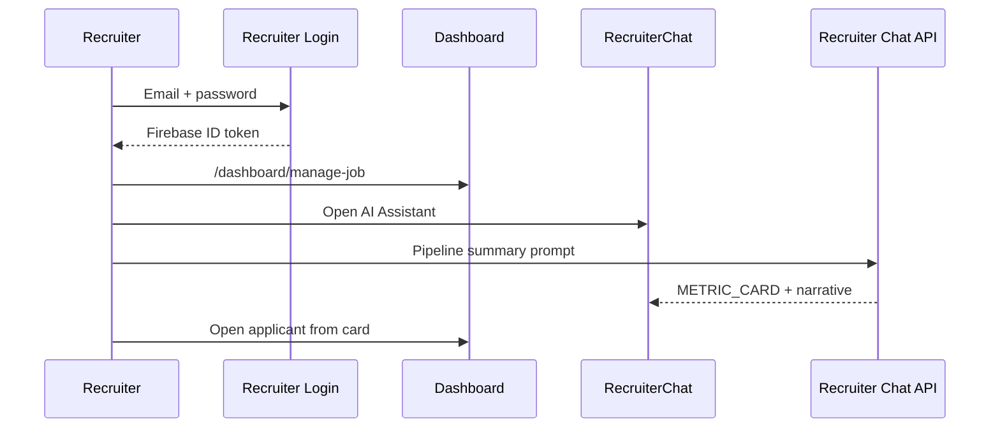

# 03 — Recruiter dashboard & chatbot UX

Specification for extending the **recruiter dashboard** with an AI assistant (HireBot) for pipeline analytics, applicant screening, job description generation, and job performance insights.

**Design choice:** Desktop-first, consistent with existing [`Dashboard.jsx`](../client/src/pages/Dashboard.jsx) glassmorphism. Chat is a dedicated dashboard section, not the applicant mobile shell.

---

## User journey



### Post-login routing

| State | Destination |
|-------|-------------|
| Recruiter login success | `/dashboard/manage-job` |
| `/dashboard` bare | Redirect to `manage-job` (existing behavior) |
| Applicant on `/dashboard` | Redirect to `/app/chat` |
| No token | Show recruiter login modal |

---

## Dashboard information architecture

### Sidebar navigation (extended)

Current items in [`Dashboard.jsx`](../client/src/pages/Dashboard.jsx):

- Add Job
- Manage Jobs
- View Applications

**Target sidebar:**

| Order | Label | Route | Icon |
|-------|-------|-------|------|
| 1 | Add Job | `/dashboard/add-job` | Plus |
| 2 | Manage Jobs | `/dashboard/manage-job` | Folder |
| 3 | Applications | `/dashboard/view-applications` | Inbox |
| 4 | **AI Assistant** | `/dashboard/ai` | Sparkles |
| 5 | **Analytics** | `/dashboard/analytics` | BarChart3 |

Footer block (unchanged): company avatar, name, sign out.

---

## AI Assistant page (`/dashboard/ai`)

### Layout (desktop)

```
┌──────────┬────────────────────────────────────────────────────────┐
│          │  AI Assistant — HireBot                    [−] [□]     │
│ Sidebar  ├────────────────────────────────────────────────────────┤
│          │  Suggested prompts (chips)                             │
│          │  [Pipeline summary] [Draft job post] [Pending apps]    │
│          ├────────────────────────────────────────────────────────┤
│          │                                                        │
│          │  Chat thread                                           │
│          │  🤖 Your pipeline: 12 applicants this week...          │
│          │      ┌──────────────┐ ┌──────────────┐                 │
│          │      │ Applications │ │ Open jobs    │  METRIC_CARDs   │
│          │      │     12       │ │      4       │                 │
│          │      └──────────────┘ └──────────────┘                 │
│          │                                                        │
│          │  👤 Top candidates for Senior React?                   │
│          │  🤖 ┌────────────────────────────────────┐             │
│          │      │ Jane Doe · Applied 2d ago · Review │ APPLICANT  │
│          │      │ [Open in Applications]             │             │
│          │      └────────────────────────────────────┘             │
│          ├────────────────────────────────────────────────────────┤
│          │  [📎 optional JD file]  Ask HireBot...          [Send] │
└──────────┴────────────────────────────────────────────────────────┘
```

### Layout (tablet / narrow)

- Full-width chat; sidebar collapses to hamburger (existing `isSidebarOpen` pattern)
- Suggested prompts wrap to two lines

### Optional: floating panel mode (phase 2)

- "Open AI" button in dashboard header opens right drawer (400px)
- Same `RecruiterChat` component; `variant="drawer" | "page"`

---

## HireBot persona

| Attribute | Value |
|-----------|--------|
| Name | HireBot |
| Tone | Professional, data-driven, concise |
| Scope | Only recruiter's company data |
| Refusal | Politely decline applicant-side career advice; suggest they use Joblet applicant app |

**Example welcome message:**

> Hi! I'm **HireBot**, your hiring assistant. I can summarize your applicant pipeline, help screen candidates, draft job descriptions, and analyze job performance. What would you like to know?

---

## Recruiter intents & prompts

| Intent | Trigger phrases | AI behavior | Rich output |
|--------|-----------------|-------------|-------------|
| `PIPELINE_SUMMARY` | "applicants this week", "pipeline summary", "how many applications" | Aggregate applications by status/date | `[METRIC_CARD:applications:12]` |
| `APPLICANT_SCREEN` | "top candidates", "best applicants for", "who applied to" | Rank applicants for a job (by date, status) | `[APPLICANT_CARD:applicationId]` |
| `JOB_PERFORMANCE` | "most popular job", "views per job", "best performing listing" | Compare jobs by application count | `[JOB_PERF:jobId]` |
| `JD_GENERATOR` | "write a job post", "draft description for" | Generate markdown JD | Text + **Use in Add Job** button |
| `GENERAL_HR` | "interview questions", "salary range for" | General HR guidance, no applicant PII | Markdown only |

Intent detection: separate keyword list in `recruiterChatbotController` (do not reuse applicant `detectIntent`).

---

## Rich tokens (recruiter)

Parsed in `RecruiterRichMessage.jsx` (new).

### `[METRIC_CARD:type:value]`

| type | Label | Example |
|------|-------|---------|
| `applications` | Total applications | 12 |
| `pending` | Pending review | 5 |
| `interviews` | In interview stage | 2 |
| `open_jobs` | Active listings | 4 |

**UI:** Small stat card, 120px min-width, indigo accent border.

```javascript
const METRIC_REGEX = /\[METRIC_CARD:([^:]+):([^\]]+)\]/g;
```

### `[APPLICANT_CARD:applicationId]`

**UI card fields:**

- Applicant name (from application denormalized `userDetails`)
- Job title
- Status badge (Applied / Review / Interview / Rejected)
- Applied date (relative)
- **Open in Applications** → `/dashboard/view-applications?highlight=:id`

Fetch: `GET /api/company/application/:id` if not in cache (must verify `companyId`).

```javascript
const APPLICANT_REGEX = /\[APPLICANT_CARD:([^\]]+)\]/g;
```

### `[JOB_PERF:jobId]`

**UI card fields:**

- Job title
- Application count
- Visibility badge (Live / Hidden)
- **Manage job** → `/dashboard/manage-job`

```javascript
const JOB_PERF_REGEX = /\[JOB_PERF:([^\]]+)\]/g;
```

---

## Suggested prompt chips

| Chip | Sends message |
|------|----------------|
| Pipeline summary | "Give me a summary of my applicant pipeline this week" |
| Draft job post | "Help me draft a job description for a Senior React Developer, remote" |
| Pending applications | "Show applications that need review" |
| Job performance | "Which of my job listings has the most applicants?" |

Chips disappear after first user message (or collapse to "Suggestions" dropdown).

---

## Analytics page (`/dashboard/analytics`)

Static widgets supplemented by AI (not chat-only).

### Widget grid

```
┌─────────────────┬─────────────────┬─────────────────┐
│  Total apps     │  This week      │  Open jobs      │
│      48         │      +12        │       6         │
├─────────────────┴─────────────────┴─────────────────┤
│  Applications over time (chart — optional phase 2)     │
├────────────────────────────────────────────────────────┤
│  Top jobs by applicants                                │
│  1. Senior React Dev — 18                              │
│  2. Product Designer — 9                               │
├────────────────────────────────────────────────────────┤
│  [Ask HireBot about these numbers] → /dashboard/ai     │
└────────────────────────────────────────────────────────┘
```

**Data:** `GET /api/company/analytics` (new) or computed client-side from existing company job/application endpoints.

**Cache:** `recruiter_insights_cache` collection (5-minute TTL) for expensive aggregates.

---

## JD generator → Add Job flow

When HireBot returns a job description:

1. Show markdown in bot bubble
2. Render CTA button: **Use in Add Job**
3. On click: `navigate('/dashboard/add-job', { state: { prefilledDescription: '...' } })`
4. [`AddJob.jsx`](../client/src/pages/AddJob.jsx) reads `location.state` and populates Quill editor

No auto-submit — recruiter must review and publish.

---

## Manage Jobs / Applications integration

| From AI | Action |
|---------|--------|
| Applicant card | Deep link to View Applications with highlight |
| Job perf card | Deep link to Manage Jobs |
| "Hide job X" | Future: confirm modal + API (out of v1) |

Existing pages unchanged; AI adds navigation shortcuts only.

---

## Design tokens (recruiter — align with dashboard)

Reuse dashboard palette for consistency:

| Token | Value | Usage |
|-------|-------|--------|
| Background | `gradient from-[#f5f7fa] via-[#ebedfb] to-[#dce3ff]` | Page (existing) |
| Card | `bg-white/70 backdrop-blur-md` | Chat container |
| Primary | `indigo-600` | Buttons, active nav |
| AI accent | `purple-600` | HireBot avatar, sparkles icon |

Chat-specific:

- User bubble: `bg-indigo-600 text-white`
- Bot bubble: `bg-white border border-gray-100 shadow-sm`
- Metric cards: `bg-indigo-50 border-indigo-100`

Typography: **Poppins** (existing dashboard `font-[Poppins]`).

---

## Components (implementation map)

| Component | Path | Responsibility |
|-----------|------|----------------|
| `RecruiterChat` | `client/src/pages/recruiter/RecruiterChat.jsx` | Full-page AI chat |
| `RecruiterRichMessage` | `client/src/components/recruiter/RecruiterRichMessage.jsx` | Token parsing |
| `MetricCard` | `client/src/components/recruiter/MetricCard.jsx` | METRIC_CARD renderer |
| `ApplicantCard` | `client/src/components/recruiter/ApplicantCard.jsx` | APPLICANT_CARD renderer |
| `JobPerfCard` | `client/src/components/recruiter/JobPerfCard.jsx` | JOB_PERF renderer |
| `RecruiterAnalytics` | `client/src/pages/recruiter/RecruiterAnalytics.jsx` | Static widgets |
| `SuggestedRecruiterChips` | `client/src/components/recruiter/SuggestedRecruiterChips.jsx` | Prompt chips |

### Dashboard modifications

| File | Change |
|------|--------|
| [`Dashboard.jsx`](../client/src/pages/Dashboard.jsx) | Add nav items AI + Analytics |
| [`App.jsx`](../client/src/App.jsx) | Register new child routes |

---

## Security UX

- Never display another company's applicant names (server enforces; UI handles 404 gracefully)
- If recruiter asks "show all users on platform" → HireBot refuses
- Session timeout: reuse existing "Not authorized, Login Again" toast → login modal

---

## Empty & error states

| Scenario | UI |
|----------|-----|
| No applicants yet | "No applications yet. Post a job to get started." + link Add Job |
| No jobs posted | Block screening intents; CTA Add Job |
| API 403 | "Session expired" + login |
| Gemini failure | "HireBot is temporarily unavailable" |

---

## Wireframe: Analytics page

```
┌──────────┬────────────────────────────────────────────────────────┐
│ Sidebar  │  Analytics                          Mon, May 31        │
│          ├────────────────────────────────────────────────────────┤
│          │  [ 48 Total ]  [ +12 Week ]  [ 6 Open Jobs ]           │
│          ├────────────────────────────────────────────────────────┤
│          │  Top jobs by applicants                                │
│          │  • Senior React Developer — 18                         │
│          │  • UX Designer — 9                                     │
│          ├────────────────────────────────────────────────────────┤
│          │  [ ✨ Ask HireBot about these numbers ]                │
└──────────┴────────────────────────────────────────────────────────┘
```

---

## Acceptance criteria (UX)

1. Recruiter cannot navigate to `/app/chat` (redirect to dashboard)
2. AI page shows pipeline summary with at least 2 metric cards
3. Applicant card opens correct application in View Applications
4. JD generator pre-fills Add Job editor when CTA clicked
5. All displayed applicants belong to recruiter's company only
6. Sidebar highlights AI Assistant when on `/dashboard/ai`

---

## Related documents

- [01 — Architecture](./01-architecture-role-separation.md)
- [05 — API & data model](./05-api-data-model.md)
- [04 — Implementation roadmap](./04-e2e-implementation-roadmap.md)
