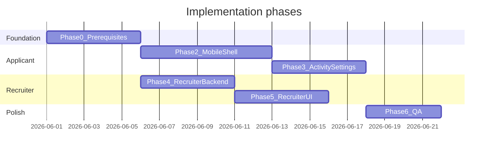

# 04 — E2E implementation roadmap

Phased plan to build the dual-role AI chatbot platform on top of the existing Joblet.AI codebase. Each phase has deliverables, file changes, dependencies, and acceptance criteria.

---

## Phase overview



| Phase | Name | Duration (est.) | Depends on |
|-------|------|---------------|------------|
| 0 | Foundation & fixes | 3–5 days | — |
| 1 | Documentation | 1 day | — (this `docs/` folder) |
| 2 | Applicant mobile shell | 5–7 days | Phase 0 |
| 3 | Activity & settings | 4–5 days | Phase 2 |
| 4 | Recruiter chat backend | 4–5 days | Phase 0 |
| 5 | Recruiter dashboard UI | 4–5 days | Phase 4 |
| 6 | Polish & E2E QA | 3–4 days | Phases 3, 5 |

Phases 2–3 and 4–5 can run **in parallel** after Phase 0.

---

## Phase 0 — Foundation (prerequisites)

Fix blockers documented in [`need_to_change.md`](../need_to_change.md) before new features.

### Tasks

| # | Task | Files |
|---|------|-------|
| 0.1 | Export `fetchUserData`, `fetchUserApplications` from AppContext | [`client/src/context/AppContext.jsx`](../client/src/context/AppContext.jsx) |
| 0.2 | Recruiter login: store Firebase **ID token** (not custom token) | [`client/src/components/RecruiterLogin.jsx`](../client/src/components/RecruiterLogin.jsx) |
| 0.3 | Server: verify password on recruiter login | [`server/controller/comapanyController.js`](../server/controller/comapanyController.js) |
| 0.4 | PDF resume upload via buffer → Firebase Storage or Cloudinary | [`server/utils/uploadResumeFile.js`](../server/utils/uploadResumeFile.js), controllers |
| 0.5 | Create `ProtectedRoute` with role redirects | `client/src/components/ProtectedRoute.jsx` (new) |
| 0.6 | Unify recruiter API headers to `Authorization: Bearer` | Dashboard pages, AppContext |

### Acceptance criteria

- [ ] Applicant can open `/applications` without Clerk errors
- [ ] Recruiter can post a job after login (`POST /api/company/post-job` returns success)
- [ ] Resume PDF uploads and applies successfully
- [ ] `ProtectedRoute` redirects recruiter away from `/app/*`

---

## Phase 1 — Documentation

**Status:** Complete — this `docs/` folder.

| File | Status |
|------|--------|
| `docs/README.md` | Done |
| `docs/01-architecture-role-separation.md` | Done |
| `docs/02-applicant-chatbot-ux.md` | Done |
| `docs/03-recruiter-dashboard-chatbot-ux.md` | Done |
| `docs/04-e2e-implementation-roadmap.md` | Done |
| `docs/05-api-data-model.md` | Done |

**Follow-up:** Add link from root [`README.md`](../README.md) to `docs/README.md` (optional, during Phase 6).

---

## Phase 2 — Applicant mobile chat shell

### Deliverables

- `AppShell` layout with bottom tab bar
- Routes: `/app/chat`, `/app/jobs`, `/app/activity`
- `ApplicantChat` wired to chat API
- Rich message renderers extracted from legacy Chatbot
- Post-login redirect for applicants → `/app/chat`

### New files

```
client/src/layouts/AppShell.jsx
client/src/components/ProtectedRoute.jsx
client/src/components/chat/BottomTabBar.jsx
client/src/components/chat/RichMessage.jsx
client/src/components/chat/SuggestedChips.jsx
client/src/components/chat/ChatJobCard.jsx
client/src/pages/applicant/ApplicantChat.jsx
client/src/pages/applicant/ApplicantJobs.jsx
client/src/styles/app-shell.css          # optional CSS variables
```

### Modified files

| File | Changes |
|------|---------|
| [`client/src/App.jsx`](../client/src/App.jsx) | Nest `/app/*` routes under `AppShell` + `ProtectedRoute` |
| [`client/src/context/AppContext.jsx`](../client/src/context/AppContext.jsx) | `sendChatMessage` → `/api/chatbot/applicant/chat` when migrated |
| [`client/src/components/Navbar.jsx`](../client/src/components/Navbar.jsx) | Logged-in applicant: link "Open App" → `/app/chat` |
| [`client/src/pages/Chatbot.jsx`](../client/src/pages/Chatbot.jsx) | Redirect to `/app/chat` if `user` present |

### Backend (minimal in this phase)

- Optional: alias route only; full split in Phase 3+

### Acceptance criteria

- [ ] Mobile 375px: tabs visible, input not obscured
- [ ] Send message → bot reply with typing indicator
- [ ] Attach PDF → parse → ask "ATS score" → `ScoreGauge` renders
- [ ] "Find remote jobs" → `[JOB_CARD]` cards with Quick Apply
- [ ] Jobs tab lists jobs from API with search filter
- [ ] Unauthenticated user cannot send messages

---

## Phase 3 — Applicant activity & settings

### Deliverables

- `SettingsSheet` bottom sheet
- `ActivityPanel` with timeline
- Firestore `chat_sessions` + `activity_logs`
- Activity API + logging middleware
- Chat session persist / restore

### New files

```
client/src/components/chat/SettingsSheet.jsx
client/src/pages/applicant/ActivityPanel.jsx
server/services/chat/activityLogger.js
server/controller/activityController.js
server/routes/activityRoutes.js
```

### Modified files

| File | Changes |
|------|---------|
| [`server/server.js`](../server/server.js) | Mount `/api/activity`, applicant chat routes |
| [`server/controller/applicantChatbotController.js`](../server/controller/applicantChatbotController.js) | Log `chat_message`, save sessions |
| [`AppContext.jsx`](../client/src/context/AppContext.jsx) | `fetchActivity`, `fetchChatSessions` |

### Acceptance criteria

- [ ] Settings sheet: profile, resume status, sign out works
- [ ] Activity tab shows last 10 events with correct icons
- [ ] Chat session persists across page reload
- [ ] `activity_logs` written on apply, resume upload, chat send
- [ ] Chat history list in settings opens past session

---

## Phase 4 — Recruiter chat backend

### Deliverables

- Split applicant/recruiter chat routes
- `recruiterChatbotController.js` with scoped queries
- Recruiter intents + rich token instructions in prompts
- `GET /api/company/analytics` (basic aggregates)

### New files

```
server/controller/applicantChatbotController.js   # extract from chatbotController
server/controller/recruiterChatbotController.js
server/routes/applicantChatbotRoutes.js
server/routes/recruiterChatbotRoutes.js
server/services/chat/intentDetector.js
server/services/chat/applicantPrompts.js
server/services/chat/recruiterPrompts.js
```

### Modified files

| File | Changes |
|------|---------|
| [`server/server.js`](../server/server.js) | Mount split routes; deprecate monolithic mount |
| [`server/controller/chatbotController.js`](../server/controller/chatbotController.js) | Re-export applicant handlers or remove |
| [`server/routes/companyRoutes.js`](../server/routes/companyRoutes.js) | Add analytics endpoint |

### Acceptance criteria

- [ ] `POST /api/chatbot/recruiter/chat` returns pipeline summary with metric tokens
- [ ] Applicant token on recruiter chat → 403
- [ ] Recruiter A cannot get Recruiter B applicants in response
- [ ] JD generator returns markdown job description
- [ ] `companyId` filter on all recruiter Firestore queries

---

## Phase 5 — Recruiter dashboard UI

### Deliverables

- `/dashboard/ai` — RecruiterChat page
- `/dashboard/analytics` — widget page
- Rich token renderers for recruiter
- Sidebar nav updates
- JD → Add Job prefill

### New files

```
client/src/pages/recruiter/RecruiterChat.jsx
client/src/pages/recruiter/RecruiterAnalytics.jsx
client/src/components/recruiter/RecruiterRichMessage.jsx
client/src/components/recruiter/MetricCard.jsx
client/src/components/recruiter/ApplicantCard.jsx
client/src/components/recruiter/JobPerfCard.jsx
client/src/components/recruiter/SuggestedRecruiterChips.jsx
```

### Modified files

| File | Changes |
|------|---------|
| [`Dashboard.jsx`](../client/src/pages/Dashboard.jsx) | Nav: AI Assistant, Analytics |
| [`App.jsx`](../client/src/App.jsx) | Child routes `ai`, `analytics` |
| [`AddJob.jsx`](../client/src/pages/AddJob.jsx) | Read `location.state.prefilledDescription` |
| [`AppContext.jsx`](../client/src/context/AppContext.jsx) | `sendRecruiterChatMessage` |

### Acceptance criteria

- [ ] Recruiter opens AI Assistant → welcome + suggested chips
- [ ] Pipeline summary shows metric cards
- [ ] Applicant card deep-links to View Applications
- [ ] "Use in Add Job" populates editor
- [ ] Analytics page shows totals and top jobs list
- [ ] Recruiter cannot access `/app/chat`

---

## Phase 6 — Polish & E2E verification

### Tasks

| # | Task |
|---|------|
| 6.1 | Manual E2E script (below) on Chrome mobile emulator + desktop |
| 6.2 | Redirect `/chatbot` → `/app/chat` for logged-in users |
| 6.3 | Rate limiting on chat endpoints (optional: `express-rate-limit`) |
| 6.4 | Firestore indexes deployed (see [05-api-data-model.md](./05-api-data-model.md)) |
| 6.5 | Update root README; point to `docs/` |
| 6.6 | Remove dead Clerk imports from package.json if unused |
| 6.7 | PWA manifest for applicant shell |

### E2E test script — Applicant

| Step | Action | Expected |
|------|--------|----------|
| A1 | Sign in with Google | Redirect to `/app/chat` |
| A2 | Tap "Find jobs" chip | Job cards in thread |
| A3 | Attach PDF, ask "ATS score" | Score gauge visible |
| A4 | Open Activity tab | Events listed |
| A5 | Open Settings → Sign out | Return to `/`, session cleared |
| A6 | Quick Apply on job card | Apply page loads |

### E2E test script — Recruiter

| Step | Action | Expected |
|------|--------|----------|
| R1 | Recruiter login | Dashboard manage jobs |
| R2 | Open AI Assistant | HireBot welcome |
| R3 | "Pipeline summary this week" | Metric cards, own data only |
| R4 | "Top applicants for [job]" | Applicant cards |
| R5 | "Draft job post for Senior React" | JD + Use in Add Job works |
| R6 | Visit `/app/chat` while logged in as recruiter | Redirect to dashboard |

### E2E test script — Security

| Step | Action | Expected |
|------|--------|----------|
| S1 | Applicant curl recruiter chat with user token | 403 |
| S2 | Recruiter token request another company's application ID | 403 or empty |
| S3 | Unauthenticated POST applicant chat | 401 |

---

## Complete file manifest (new + modified)

### Client — new

| Path |
|------|
| `client/src/layouts/AppShell.jsx` |
| `client/src/components/ProtectedRoute.jsx` |
| `client/src/components/chat/BottomTabBar.jsx` |
| `client/src/components/chat/SettingsSheet.jsx` |
| `client/src/components/chat/RichMessage.jsx` |
| `client/src/components/chat/SuggestedChips.jsx` |
| `client/src/components/chat/ChatJobCard.jsx` |
| `client/src/pages/applicant/ApplicantChat.jsx` |
| `client/src/pages/applicant/ApplicantJobs.jsx` |
| `client/src/pages/applicant/ActivityPanel.jsx` |
| `client/src/pages/recruiter/RecruiterChat.jsx` |
| `client/src/pages/recruiter/RecruiterAnalytics.jsx` |
| `client/src/components/recruiter/RecruiterRichMessage.jsx` |
| `client/src/components/recruiter/MetricCard.jsx` |
| `client/src/components/recruiter/ApplicantCard.jsx` |
| `client/src/components/recruiter/JobPerfCard.jsx` |
| `client/src/components/recruiter/SuggestedRecruiterChips.jsx` |

### Server — new

| Path |
|------|
| `server/controller/applicantChatbotController.js` |
| `server/controller/recruiterChatbotController.js` |
| `server/controller/activityController.js` |
| `server/routes/applicantChatbotRoutes.js` |
| `server/routes/recruiterChatbotRoutes.js` |
| `server/routes/activityRoutes.js` |
| `server/services/chat/intentDetector.js` |
| `server/services/chat/applicantPrompts.js` |
| `server/services/chat/recruiterPrompts.js` |
| `server/services/chat/activityLogger.js` |

### Client — modified

| Path |
|------|
| `client/src/App.jsx` |
| `client/src/context/AppContext.jsx` |
| `client/src/pages/Dashboard.jsx` |
| `client/src/pages/Chatbot.jsx` |
| `client/src/pages/AddJob.jsx` |
| `client/src/components/Navbar.jsx` |
| `client/src/components/RecruiterLogin.jsx` |

### Server — modified

| Path |
|------|
| `server/server.js` |
| `server/controller/chatbotController.js` |
| `server/controller/comapanyController.js` |
| `server/routes/companyRoutes.js` |

---

## Risk register

| Risk | Mitigation |
|------|------------|
| Gemini rate limits / latency | Timeouts, friendly error bubbles, optional response cache for analytics |
| Resume parse failures | Validate PDF server-side; clear client error messages |
| Dual token storage confusion | Document in onboarding; never mix applicant/recruiter in same browser profile for testing |
| Firestore index missing | Deploy indexes before Phase 3 QA |
| Legacy `/chatbot` bookmarks | 301 redirect to `/app/chat` |

---

## Definition of done (project)

- [ ] All Phase 0–6 acceptance criteria checked
- [ ] `docs/` complete and linked from project README
- [ ] No cross-role data leaks in manual security tests
- [ ] Applicant shell usable on 375px viewport
- [ ] Recruiter AI + analytics usable on 1280px desktop

---

## Related documents

- [01 — Architecture](./01-architecture-role-separation.md)
- [02 — Applicant UX](./02-applicant-chatbot-ux.md)
- [03 — Recruiter UX](./03-recruiter-dashboard-chatbot-ux.md)
- [05 — API & data model](./05-api-data-model.md)
