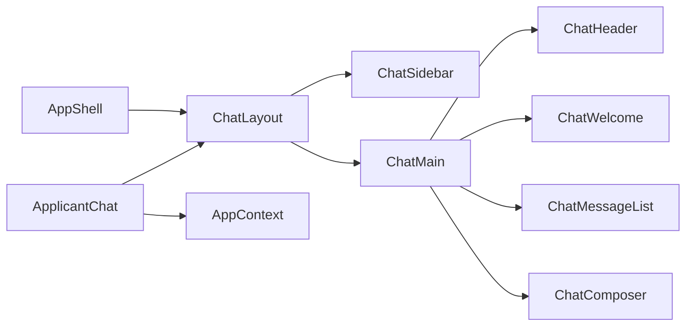

# 06 — Chat UI upgrade (FLUX-inspired)

End-to-end plan to elevate the applicant chatbot UI using the FLUX reference design, adapted for **CareerBot / Joblet AI**.

---

## Goals

| Goal | Detail |
|------|--------|
| Premium chat workspace | Light, spacious main area with rounded composer (FLUX-style) |
| Session history | Sidebar on desktop; drawer on mobile — grouped by Today / Yesterday / date |
| Clear actions | Prominent **+ New Chat**, attach resume, loading state on send |
| Responsive | Mobile-first bottom tabs preserved; desktop sidebar replaces tabs |
| No backend changes | Reuse existing `/api/chatbot/applicant/*` session APIs |

---

## Design mapping (FLUX → CareerBot)

| FLUX element | CareerBot adaptation |
|--------------|---------------------|
| Left sidebar + search | `ChatSidebar` — search sessions, nav to Jobs/Activity |
| History (Today, Yesterday…) | Group `fetchChatSessions()` by `updatedAt` |
| + New Chat header button | `ChatHeader` — starts fresh thread |
| Sparkle input placeholder | CareerBot prompt + suggested chips |
| Attach button | PDF resume attach (existing flow) |
| Loading button | Spinner + "Thinking…" while `isTyping` |
| User profile (bottom sidebar) | Avatar, name, role from Firebase `user` |
| Imagine/media preview | Rich tokens: `ScoreGauge`, `ChatJobCard` in thread |

**Accent:** `#FF4E25` (marketing brand orange) for primary actions; slate neutrals for surfaces.

---

## Architecture

### File manifest

| File | Role |
|------|------|
| `client/src/layouts/ChatLayout.jsx` | Desktop sidebar + mobile drawer shell |
| `client/src/components/chat/ChatSidebar.jsx` | Search, nav, history, profile |
| `client/src/components/chat/ChatHeader.jsx` | Brand, New Chat, menu (mobile) |
| `client/src/components/chat/ChatComposer.jsx` | Attach, textarea, send/loading |
| `client/src/components/chat/ChatMessageList.jsx` | Thread + typing indicator |
| `client/src/components/chat/ChatWelcome.jsx` | Empty-state hero + chips |
| `client/src/styles/chat.css` | Chat tokens, animations, composer |
| `client/src/pages/applicant/ApplicantChat.jsx` | State + API wiring (refactored) |

---

## E2E test plan

### Visual / layout

| # | Step | Expected |
|---|------|----------|
| V1 | Open `/app/chat` at 375px width | Bottom tabs visible; no horizontal scroll |
| V2 | Open `/app/chat` at 1280px width | Sidebar visible; bottom tabs hidden |
| V3 | Only welcome message shown | `ChatWelcome` hero + chip grid visible |
| V4 | Send a message | Welcome hides; bubbles animate in |
| V5 | While waiting for reply | Composer shows loading state; typing dots |

### Session history

| # | Step | Expected |
|---|------|----------|
| H1 | Sign in, send 2+ messages | Session saved server-side |
| H2 | Reload page | Thread restores from localStorage session id |
| H3 | Desktop sidebar | Session appears under Today |
| H4 | Click past session | URL `?session=id`; messages load |
| H5 | + New Chat | Clears session; welcome state returns |
| H6 | Mobile menu → History | Drawer lists sessions |

### Resume & rich content

| # | Step | Expected |
|---|------|----------|
| R1 | Attach PDF | Chip shows filename; parsing state |
| R2 | Ask "ATS score" | `ScoreGauge` renders inline |
| R3 | Tap "Find remote jobs" chip | `ChatJobCard` with Quick Apply |

### Auth & errors

| # | Step | Expected |
|---|------|----------|
| A1 | Not signed in | Banner + disabled composer; Google CTA |
| A2 | API failure | Bot bubble with error copy |
| A3 | Parse PDF fails | Toast; attachment removed |

### Regression (other tabs)

| # | Step | Expected |
|---|------|----------|
| T1 | Jobs tab | Search + list unchanged |
| T2 | Activity tab | Timeline loads |
| T3 | Settings sheet | Sign out works |

---

## Acceptance criteria

- [ ] Chat matches FLUX layout patterns on desktop (sidebar + centered thread)
- [ ] Mobile UX unchanged in spirit (tabs, full-height chat)
- [ ] All Phase 2 chat acceptance criteria from [04-e2e-implementation-roadmap.md](./04-e2e-implementation-roadmap.md) still pass
- [ ] No new API endpoints required
- [ ] WCAG AA contrast on orange primary buttons (white text)

---

## Related documents

- [02 — Applicant chatbot UX](./02-applicant-chatbot-ux.md)
- [04 — Implementation roadmap](./04-e2e-implementation-roadmap.md)
