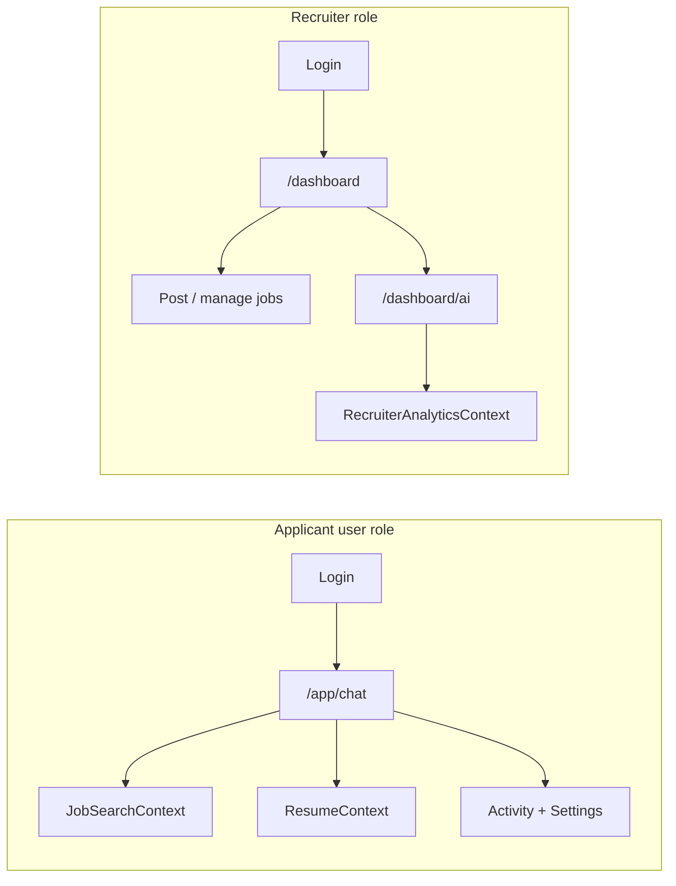

# Joblet.AI — Dual-Role AI Chatbot Platform

Documentation for the end-to-end design of a **dual-role** job platform: applicants use a **mobile-first AI chat shell** for job search and resume matching; recruiters use a **separate dashboard** with an AI assistant for posting, pipeline management, and analytics.

---

## Documentation index

| Document | Description |
|----------|-------------|
| [01 — Architecture & role separation](./01-architecture-role-separation.md) | System boundaries, auth, routes, data scoping |
| [02 — Applicant chatbot UX](./02-applicant-chatbot-ux.md) | Mobile-first chat shell, tabs, settings, context scopes |
| [03 — Recruiter dashboard & chatbot UX](./03-recruiter-dashboard-chatbot-ux.md) | Dashboard extensions, AI assistant, analytics |
| [04 — E2E implementation roadmap](./04-e2e-implementation-roadmap.md) | Phased build order, files, acceptance criteria |
| [05 — API & data model](./05-api-data-model.md) | Endpoints, Firestore schema, indexes, activity logging |
| [06 — Chat UI upgrade (FLUX-inspired)](./06-chat-ui-upgrade-plan.md) | Desktop sidebar, composer, session history, E2E test plan |
| [E2E verification checklist](./e2e-verification.md) | Manual QA scripts (Phase 6) |

**Related repo docs (legacy / audit):**

- [`../need_to_change.md`](../need_to_change.md) — Current-state audit and known blockers
- [`../implementation_plan.md`](../implementation_plan.md) — Original applicant CareerBot plan (largely implemented)

---

## Glossary

| Term | Definition |
|------|------------|
| **Applicant** | Job seeker with Firebase role `user`. Uses Google/email sign-in. |
| **Recruiter** | Employer with Firebase role `recruiter`. Uses email/password via recruiter login. |
| **App shell** | Mobile-first layout at `/app/*` with bottom tab bar (Chat, Jobs, Activity, Settings). |
| **CareerBot** | Applicant-facing AI persona (career coach + job matcher). |
| **HireBot** | Recruiter-facing AI persona (hiring analyst + pipeline advisor). |
| **JobSearchContext** | Chat context scope: natural-language job search against Firestore `jobs`. |
| **ResumeContext** | Chat context scope: PDF resume parsed text used for ATS scoring and job matching. |
| **Rich token** | Structured string in AI replies parsed by the UI (e.g. `[JOB_CARD:abc123]`). |
| **Activity log** | Server-written event record powering the applicant Activity tab. |
| **Chat session** | Persisted conversation thread in `chat_sessions` collection. |

---

## Role overview

Two products share one Firebase project. They **must not** share chat UI, API routes, or system prompts.

| Dimension | Applicant | Recruiter |
|-----------|-----------|-----------|
| Post-login landing | `/app/chat` | `/dashboard/manage-job` |
| Primary UI | Full-screen mobile chat | Desktop dashboard + AI page |
| Chat API prefix | `/api/chatbot/applicant/*` | `/api/chatbot/recruiter/*` |
| Rich tokens | `[SCORE_BADGE]`, `[JOB_CARD]` | `[METRIC_CARD]`, `[APPLICANT_CARD]`, `[JOB_PERF]` |
| Data scope | Own profile, applications, public jobs | Own company jobs and applicants only |

---

## Current vs target state

| Area | Today (repo) | Target |
|------|--------------|--------|
| Applicant chat | [`client/src/pages/Chatbot.jsx`](../client/src/pages/Chatbot.jsx) at `/chatbot` | New shell at `/app/chat` |
| Recruiter chat | None | `/dashboard/ai` |
| Chat API | `POST /api/chatbot/chat` (user only) | Split applicant + recruiter routes |
| Activity hub | Scattered (`/applications`, resume analyzer) | Unified Activity tab + `activity_logs` |
| Settings in chat | None | Bottom sheet from tab bar |

---

## Tech stack (actual)

| Layer | Technology |
|-------|------------|
| Frontend | React 18, Vite, Tailwind, React Router, Axios, Firebase Auth |
| Backend | Express, Firebase Admin, Gemini 1.5 Flash |
| Database | Firestore (`jobs`, `users`, `companies`, `applications`, `resume_analyses`) |
| New collections | `chat_sessions`, `activity_logs`, `recruiter_insights_cache` |

---

## Design direction

- **Marketing site** (`/`, Navbar): existing Joblet.AI brand (brand-orange, brand-navy, Outfit).
- **Applicant app shell** (`/app/*`): **new** mobile-first dark chat UI (see [02-applicant-chatbot-ux.md](./02-applicant-chatbot-ux.md)).
- **Recruiter dashboard** (`/dashboard/*`): extend existing glassmorphism dashboard (see [03-recruiter-dashboard-chatbot-ux.md](./03-recruiter-dashboard-chatbot-ux.md)).

---

## Out of scope

- Single account with both applicant and recruiter roles
- Native iOS/Android apps (PWA-ready mobile web only)
- WebSocket/SSE streaming in v1 (request/response first)
- Full marketing homepage redesign

---

## How to use these docs

1. **Product / design** — Start with [02](./02-applicant-chatbot-ux.md) and [03](./03-recruiter-dashboard-chatbot-ux.md).
2. **Engineering** — Read [01](./01-architecture-role-separation.md), then [05](./05-api-data-model.md), then [04](./04-e2e-implementation-roadmap.md).
3. **QA** — Use acceptance criteria in [04](./04-e2e-implementation-roadmap.md).
